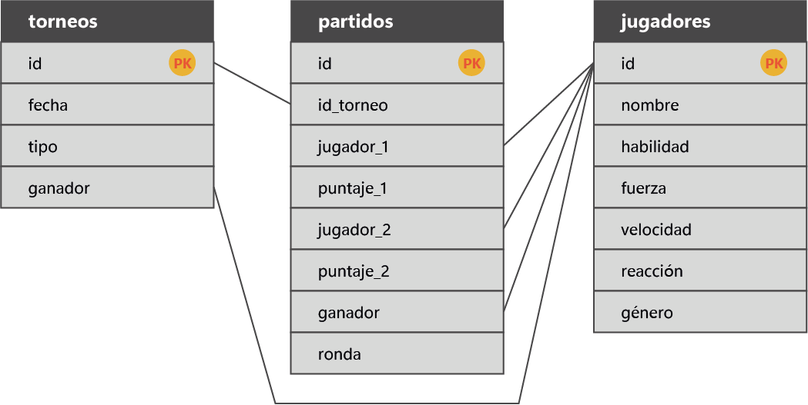

###################
Torneo Tennis
###################

El proyecto tiene 3 clases que corresponden al siguiente diagrama:

- Se utilizo como framework codeigniter 3.
- La clase jugador adquiere los 3 atributos extras ademas de la habilidad, pero se utilizan los correspondientes al género según la consigna.
- Los factores extra a la habilidad (fuerza, velocidad, reacción) se los divide para reducir el impacto sobre el puntaje total dando protagonismo al factor base habildiad.
- El elemento suerte se calcula agregando aproximadamente entre un 0%-25% extra del puntaje total de cada jugador.
- El sistema calcula un número máximo de participantes posibles que sean potencia de 2 segun la cantidad de registros en la tabla del genero correspondiente.

************
Installation
************

- Copiar el repositorio
- Crear la base mysql llamada "torneo"
- Ejecutar la URL http://localhost/torneo/migrate/index para migrar los datos a una base
- Corre sobre versión 8.0 php

************
Uso
************

http://localhost/torneo/home/index es la url principal del proyecto donde se selecciona el genero del torneo y se redirije a los resultados.

